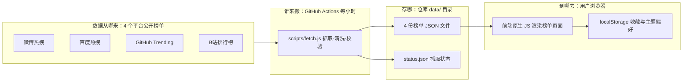

# TECH_DESIGN —— 迷你聚合热搜（mini-hot）

> 版本：v1.0 ｜ 日期：2026-09-19 ｜ 作者：Panky（与 AI 协作）
> 前置文档：`research.md`（Day 3 立项调研）、`PRD.md` v1.3（Day 4 产品需求定稿）
> 文档性质：**技术设计文档**。回答「怎么实现 PRD 描述的产品」：技术选型、项目结构、数据模型、数据流、错误处理、环境变量与迁移注意事项。
> 技术路线与前端方案已于 2026-09-19 由 Panky 拍板（见 §1.3 决策记录）。

---

## 一、技术选型

### 1.1 候选方案对比

PRD 拍板的约束先行：**免服务器、免数据库、无账号系统、零成本**（PRD §十、§5.1 F8 实现前提）。在此约束下比较了三套路线：

| 维度 | 方案 A：纯静态<br>（Actions 抓取 → 静态 JSON → GitHub Pages） | 方案 B：CloudBase 全家桶<br>（云函数 + PostgreSQL + 云托管） | 方案 C：静态前端 + 第三方聚合 API |
|---|---|---|---|
| 架构 | GitHub Actions 定时跑抓取脚本，产出 JSON 文件提交仓库，Pages 托管前端 | React/Vite 前端 + 云函数抓取入库 + 数据库查询接口 | 前端直接调用现成的聚合热榜接口 |
| 成本 | 0 元（公开仓库 Pages 免费额度足够） | 免费额度内 0 元，超额计费 | 0 元 |
| 运维负担 | 近乎零，故障排查看 Actions 日志 | 云函数 / 数据库 / 托管三套都要维护 | 完全受制于第三方，接口挂了无法自修 |
| 学习价值 | Git/CI、爬虫与数据清洗、原生前端——与「系统性学习」的项目动机一致 | 额外学后端与数据库，但一期同时学 4 样，烂尾风险高 | 几乎学不到核心技术 |
| 与 PRD 合规性 | ✅ 完全一致 | ❌ 引入数据库与后端，需先改 PRD 范围（历史存档、云存储均列二期） | ⚠️ E1「单源失效」无法自己修复，稳定性失控 |
| 数据新鲜度 | 小时级（Actions 排队有分钟级延迟），满足 PRD「小时级」 | 实时级（超出需求） | 取决于第三方更新频率 |

### 1.2 推荐路线与取舍说明

**推荐：方案 A（纯静态）**，2026-09-19 已拍板采纳。

取舍逻辑：

1. **与 PRD 零冲突**：PRD 的收藏（localStorage）、无账号、小时级更新、GitHub Pages 部署，全部天然落在方案 A 内，不需要改任何已定范围。
2. **成本与运维为零**：学习作品最怕「功能没做完，服务器/账单先变成负担」。方案 A 没有任何需要付费或长期照看的基础设施。
3. **失败模式可控**：单源抓取失败只影响一个 JSON 文件不更新（对应 PRD E1），前端按「上次成功数据 + 状态标记」优雅降级即可，不需要后端兜底。
4. **CloudBase 不是不做，是二期再做**：等 F7 收藏云端同步、F8 历史趋势真实需要后端与数据库时，再出「TECH_DESIGN 二期增补」。一期为那次迁移预留的注意点见 §10。
5. **放弃方案 C 的理由**：核心学习目标就是「自己抓数据」，用别人的聚合 API 等于把项目最有价值的部分外包出去；且第三方接口随时可能停服，E1/E13 无法自控。

### 1.3 决策记录（2026-09-19 拍板）

| 决策项 | 结论 | 决策人 |
|---|---|---|
| 技术路线 | 方案 A：纯静态（GitHub Actions → 静态 JSON → GitHub Pages） | Panky |
| 前端技术 | **原生 HTML / CSS / JavaScript**，零依赖零构建 | Panky |
| 后端 / 数据库 | 本期没有。无任何自有 API 服务，无数据库 | Panky（沿用 PRD） |

**原生 JS 的取舍**：放弃了 React/Vite。代价是没有组件化、没有现成状态管理；换来的是零 npm 依赖、零构建步骤、与仓库里已有的 `index.html` 直接延续，且单页 4 个 Tab + 收藏视图的复杂度用原生 JS 完全写得动。若未来二期引入框架，见 §10 迁移注意。

---

## 二、总体架构与数据流

**数据流图**（Mermaid 代码，GitHub 网页上会渲染成图；本地纯文本阅读时可看下方的文本版架构图）：



**架构示意（文本版）**：

```
┌──────────────────────────  数据生产侧（每天在 GitHub 上跑） ──────────────────────────┐
│                                                                                      │
│  GitHub Actions（每小时第 5 分钟触发）                                                 │
│      │  1. checkout 仓库                                                             │
│      │  2. 运行 scripts/fetch.js（Node.js，无第三方依赖）                              │
│      │       ├─ 抓 微博热搜接口                                                       │
│      │       ├─ 抓 百度热搜接口                                                       │
│      │       ├─ 抓 GitHub Trending                                                    │
│      │       └─ 抓 B站排行榜接口                                                       │
│      │  3. 每个源独立 try/catch：成功的源 → 清洗/校验 → 写 data/<source>.json；         │
│      │     失败的源 → 不动该文件，data/<source>.status.json 记录失败                    │
│      │  4. git commit + push（仅当 data/ 有变化）                                      │
│                                                                                      │
└──────────────────────────────────────────────────────────────────────────────────────┘
                                        │ git push 触发
                                        ▼
┌──────────────────────────  数据消费侧（用户浏览器） ──────────────────────────────────┐
│                                                                                      │
│  GitHub Pages（自动部署 main 分支）                                                    │
│      │                                                                              │
│      ▼                                                                              │
│  index.html + css/ + js/（原生 JS，零构建）                                            │
│      ├─ 页面加载 → fetch data/*.json（并行 4 个，谁先到谁先渲染，对应 PRD E8）          │
│      ├─ 收藏读写 → localStorage（key：minihot.favorites）                             │
│      └─ 主题读写 → localStorage（key：minihot.theme）+ 系统偏好 matchMedia            │
│                                                                                      │
└──────────────────────────────────────────────────────────────────────────────────────┘
```

数据流要点（每条都对应 PRD 验收项）：

1. **抓取与展示彻底分离**：用户浏览器永远不直接请求各平台接口——绕开 CORS 限制、跨域封禁与 IP 风控，也保证页面秒开。
2. **单源独立成败**：Actions 里 4 个源各自独立抓取、独立写文件。一个源挂了，其余 3 个照常更新（PRD E1 的技术根基）。
3. **「上次成功数据」原则**：某源本次抓取失败时，**不删除、不覆盖**该源上一次成功的 JSON，只写状态文件。前端据此显示「上次成功更新：XX:XX」（PRD E1）。
4. **增量提交**：只有 data/ 内容真正变化时才产生 commit，避免每小时 4 个空提交刷屏提交历史。

---

## 三、项目结构

```
mini-hot/
├── index.html                  # 唯一页面（已存在的占位页将在此扩展）
├── css/
│   ├── base.css                # CSS 变量（深浅两套色板）、reset、排版基线
│   ├── layout.css              # 页头 / Tab / 列表 / 页脚布局
│   └── components.css          # 条目、Tab、收藏按钮、空状态、骨架屏样式
├── js/
│   ├── main.js                 # 入口：初始化主题 → 并行拉数据 → 首屏渲染
│   ├── api.js                  # fetch 封装：超时、重试、超时降级逻辑（对应 E6/E7/E8）
│   ├── render.js               # 列表 / Tab / 时效 / 空状态 / 骨架屏渲染
│   ├── favorites.js            # 收藏 CRUD，全部经 localStorage（对应 F3、E9/E10）
│   └── theme.js                # 深浅模式：系统跟随 + 手动覆盖 + 本机记忆（对应 §6.2.1）
├── scripts/
│   └── fetch.js                # Actions 抓取脚本（Node.js，无第三方依赖）
│       └── sources/            # 每源一个适配器，单源失效不拖垮其他源
│           ├── weibo.js
│           ├── baidu.js
│           ├── github.js
│           └── bilibili.js
├── data/                       # Actions 产出的静态 JSON（抓取成果，唯一数据源）
│   ├── weibo.json
│   ├── baidu.json
│   ├── github.json
│   ├── bilibili.json
│   └── status.json             # 各源最近一次抓取结果（成功/失败 + 时间戳）
├── docs/                       # 已有：Day1/Day2 文档
├── .github/
│   └── workflows/
│       └── fetch.yml           # 定时抓取工作流
├── .gitignore                  # 已有
├── PRD.md                      # 已有
├── research.md                 # 已有
└── README.md                   # 已有
```

结构说明：

- **`data/` 是「数据库」**：整个系统里唯一被程序写入的持久化数据就是这 5 个 JSON 文件。把它理解为「每小时快照一次的只读数据库」最贴切。
- **`scripts/sources/` 一源一文件**：对应 PRD E13「单源可下线、可替换」——下线某个源 = 删一个适配器文件 + 改一行配置，不动其他代码。
- **无 `node_modules`、无 `package.json` 依赖项**：抓取脚本只用 Node 内置模块（`fetch`、`fs`），前端零依赖。`package.json` 仅作为 `npm run fetch` 的本地调试入口存在，不声明任何第三方依赖。

---

## 四、数据模型

### 4.1 榜单文件 `data/<source>.json`

```jsonc
{
  "source": "weibo",              // 必要，固定标识：weibo | baidu | github | bilibili
  "listTitle": "微博热搜榜",       // 必要，PRD §7.4
  "listType": "realtime",         // 必要，时间窗口：realtime | daily24h | daily | weekly
  "listUpdatedAt": "2026-09-19T14:05:00+08:00",  // 必要，ISO 8601 带时区，前端格式化为「更新于 14:05」
  "listStatus": "ok",             // 必要，ok | empty | failed（驱动 PRD E1/E3）
  "itemCount": 50,                // 可选，用于序号连续性校验（PRD A4）
  "items": [
    {
      "source": "weibo",          // 必要，与顶层一致（条目冗余一份，收藏时可直接取用）
      "rank": 1,                  // 必要，正整数，从 1 连续递增
      "title": "条目标题文字",      // 必要
      "url": "https://...",       // 必要，跳原平台的真实链接
      "heat": 5123000,            // 可选，数字或字符串「512.3万」，原样保留不换算
      "heatLabel": "热搜指数",     // 可选，口径名，防止跨源误比（PRD §7.3 约束）
      "tags": ["沸"],              // 可选，原平台标签，原样呈现
      "extra": {                  // 可选，源特有字段（PRD §7.3），按源不同
        "lang": "JavaScript",     //   GitHub：主要语言
        "stars": 123456,          //   GitHub：总 star
        "up": "某UP主",            //   B站：UP 主
        "play": 2345678           //   B站：播放量
      }
    }
  ]
}
```

**写入前校验（抓取脚本强制执行，对应 PRD E4）**：

- `source` / `rank` / `title` / `url` 五要素任一缺失或 `url` 非合法 http(s) 链接的条目 → **直接丢弃，不写入**（宁可少一条，不可出现死链）。
- `rank` 写入前重排为从 1 连续递增（丢弃条目后可能出现空洞，重排保证 PRD A4 验收）。
- 校验后 `items` 为空 → 写 `"listStatus": "empty"`（对应 PRD E3）。

### 4.2 抓取状态文件 `data/status.json`

```jsonc
{
  "updatedAt": "2026-09-19T14:05:00+08:00",   // 本次 Actions 运行时间
  "sources": {
    "weibo":    { "status": "ok",     "lastSuccessAt": "2026-09-19T14:05:00+08:00", "lastError": null },
    "baidu":    { "status": "ok",     "lastSuccessAt": "2026-09-19T13:05:00+08:00", "lastError": null },
    "github":   { "status": "failed", "lastSuccessAt": "2026-09-18T20:05:00+08:00", "lastError": "HTTP 403" },
    "bilibili": { "status": "ok",     "lastSuccessAt": "2026-09-19T14:05:00+08:00", "lastError": null }
  }
}
```

- 抓取失败时该源 JSON **保持上一次成功版本**，`status.json` 记录失败原因。前端用 `lastSuccessAt` 渲染「上次成功更新：昨天 20:00」（PRD E1）。
- 数据过期警示（PRD E5）：前端比较 `lastSuccessAt` 与当前时间，超过 6 小时 → 时效说明切换为警示态样式。

### 4.3 收藏记录（localStorage，key：`minihot.favorites`）

```jsonc
[
  {
    "id": "weibo-1-3f2a",       // 稳定标识 = source + rank + url 短哈希（见 §4.4）
    "title": "收藏时的标题快照",
    "url": "https://...",
    "source": "weibo",
    "savedAt": 1726728300000,   // 收藏时刻毫秒时间戳，收藏列表按此倒序（PRD §6.2）
    "rank": 1,                  // 可选快照
    "heat": 5123000             // 可选快照
  }
]
```

- 存取规则：整体读出 → 修改 → 整体写回（单 key 简单可靠）；收藏上限 500 条（对应 PRD E10），超限提示清理，不静默丢弃。
- 容量兜底：写入前 `try/catch`，抛 `QuotaExceededError` 或任何存储异常 → 轻提示「当前浏览器无法保存收藏」，看榜不受影响（PRD E9）。

### 4.4 主题偏好（localStorage，key：`minihot.theme`）

- 值：`"dark"` | `"light"` | 未设置。
- 未设置 → 跟随系统 `prefers-color-scheme`（PRD M1）；设置后手动值永久优先（PRD M9）。
- 读取异常时按「未设置」处理，安静降级（PRD M8）。

### 4.5 条目稳定 ID 的设计说明

收藏需要「刷新后仍识别同一条目」，但热榜排名每小时都在变，所以 **id 不能只用 rank**。约定：`<source>-<rank>-<url哈希前4位>`。同一 URL 收藏过则视为同一条（再次收藏 = 取消收藏的 toggle 判断依据），排名变化不影响已收藏条目——因为收藏时已把 title/url/source 做了快照（PRD §7.5）。

---

## 五、API 清单

### 5.1 自有 API：无（本期明确不建）

本期**没有任何自有后端 API**。前端消费的全部「接口」是 `data/` 下的静态 JSON 文件，本质是「每次 fetch 一个静态资源」，不存在请求路由、鉴权、限流问题。这是方案 A 的直接结果，也是「零服务器」承诺的技术体现。

### 5.2 前端消费的静态数据文件

| 路径 | 方法 | 返回 | 失败时前端行为 |
|---|---|---|---|
| `./data/weibo.json` | GET | 榜单 JSON（§4.1） | 该 Tab 显示 E1 文案，其他源不受影响 |
| `./data/baidu.json` | GET | 同上 | 同上 |
| `./data/github.json` | GET | 同上 | 同上 |
| `./data/bilibili.json` | GET | 同上 | 同上 |
| `./data/status.json` | GET | 状态 JSON（§4.2） | 拿不到则不显示「上次成功更新」，不影响列表 |

**注意路径写法**：必须用相对路径 `./data/...` 而非 `/data/...`。GitHub Pages 项目页部署在 `https://panky-pan.github.io/mini-hot/` 子路径下，绝对路径会 404（详见 §10.2）。

### 5.3 上游数据源接口（Actions 抓取目标）

> ⚠️ **本节为临时假设，全部待第 1 周（Day 5 起）逐个手工实测后定稿**。下表是 research.md 调研阶段的候选入口，实测时确认「能返回什么字段、有没有反爬门槛」，再回填本表。

| 来源 | 候选入口（临时假设） | 已知风险 | 实测要确认的事 |
|---|---|---|---|
| 微博热搜 | 移动端热搜接口（返回 JSON，公开可访问） | 接口地址可能变动、有频控 | 字段映射、URL 构造方式、单 IP 频率容忍度 |
| 百度热搜 | 热搜榜接口（公开 JSON） | 同上 | 同上 |
| GitHub Trending | Trending 页面 HTML 解析（无官方榜单 API）；或 Search API `sort=stars` | 页面改版会导致解析失效；API 有速率限制 | 二选一定稿；解析器健壮性 |
| B站排行榜 | 排行榜接口（公开 JSON，需部分参数） | 可能要求特定请求头 | 必要参数、字段映射、频控 |

适配器统一约定（`scripts/sources/*.js`）：

- 每个适配器导出 `async function fetchSource()`，成功返回符合 §4.1 的完整对象，失败 `throw Error`。
- 单次请求超时 15 秒；失败不重试（小时级任务，下个小时自然重试，避免同一小时反复触发风控）。
- 响应体统一 `JSON.parse` 或文本解析后**先校验再写入**（§4.1 校验规则）。

---

## 六、前端模块与数据流

### 6.1 首屏加载流程

```
打开页面
  → theme.js：读 localStorage.minihot.theme
      ├─ 有值 → 应用该模式（M9）
      └─ 无值 → matchMedia('(prefers-color-scheme: dark)')（M1）
  → main.js：对 4 个 data/*.json 发起并行 fetch（超时 8 秒）
      ├─ 任一源先返回 → 立即渲染该源为默认展示 Tab，替换骨架屏（E8）
      ├─ 全部返回前 → 显示骨架屏（E7），超过 8 秒未全部到达 → 已到的先渲染，未到的显示 E6 提示 + 重试按钮
      └─ fetch 网络层失败（断网）→ 数据区显示「加载失败，请检查网络后刷新」+ 重试（E6）
  → favorites.js：读 localStorage，给列表打「已收藏」标记
```

### 6.2 运行时数据流

| 用户动作 | 数据流 |
|---|---|
| 切换 Tab（F1.2） | 内存中已缓存的 4 份 JSON 直接渲染，**不发新请求**——切换瞬时完成，无白屏闪烁 |
| 点击标题（F2.1） | `<a href="<url>" target="_blank" rel="noopener">`，纯原生跳转，JS 不拦截 |
| 收藏 / 取消（F3.1/F3.2） | favorites.js 改内存数组 → 整体写回 localStorage → 重渲染该条按钮态 |
| 打开收藏视图（F3.3） | 直接渲染内存收藏数组（按 savedAt 倒序），不发请求 |
| 切换主题（§6.2.1） | 改 `<html data-theme>` 属性 → CSS 变量整体切换 → 写 localStorage；全程无重载、无滚动复位（M2/M3） |

### 6.3 渲染约定

- 列表渲染用 `documentFragment` 一次性插入，避免逐条 reflow。
- 所有条目文本（title、heatLabel、tags、UP 主名等来自外部的字符串）**必须经 `textContent` 写入，禁止 `innerHTML` 拼接**——抓来的标题是外部输入，防 XSS 是底线。
- 长标题截断用 CSS（`-webkit-line-clamp: 2`，PRD 原则 3），不用 JS 算字数。

---

## 七、错误处理

PRD §八已定义 14 种异常的用户视角表现，本节给出每一条的技术实现位置，形成 PRD ↔ 代码的对照表：

| PRD 编号 | 场景 | 技术实现 |
|---|---|---|
| E1 单源抓取失败 | 抓取侧：适配器 throw → 该源 JSON 不动 → status.json 记 failed。展示侧：`listStatus` 或 status.json 为 failed → 该 Tab 渲染 E1 文案 + lastSuccessAt |
| E2 全部失败 | status.json 的 4 个源全 failed → 顶部渲染一条静默提示条（非弹窗） |
| E3 源数据为空 | 抓取侧校验 items 为空 → 写 `listStatus: "empty"` → 前端渲染「该来源当前没有内容」 |
| E4 条目缺字段 | 抓取侧写入前校验（§4.1），缺字段条目不落盘 |
| E5 数据过期 | 前端：`now - lastSuccessAt > 6h` → 时效说明切换警示样式 |
| E6 用户断网 | 前端 fetch 抛错（区别于「拿到了 failed 状态」）→ E6 文案 + 重试按钮 |
| E7 加载中 | 骨架屏（与真实列表同结构），无全屏遮罩；8 秒超时转 E6 |
| E8 加载极慢 | 4 个 fetch 并行、先到先渲染（§6.1） |
| E9 存储不可用 | favorites.js 所有读写包 try/catch → 一次性轻提示，收藏按钮降级隐藏 |
| E10 收藏超上限 | 写入前查条数 > 500 → 提示清理，拒绝本次写入但不丢旧数据 |
| E11 收藏链接失效 | 不做检测（PRD 明确），原样保留跳转 |
| E12~E14 合规类 | 不适用技术处理；页脚声明由 F4 保证 |

**抓取侧错误纪律**（对应 PRD §8.5 的生产侧版本）：

1. 单源 throw 不影响其他源（独立 try/catch）；
2. status.json 如实记录 `lastError`（说实话）；
3. 失败源保留上次成功数据（给退路）；
4. 抓取失败**不导致 Actions 工作流失败**——4 个源全挂时脚本也正常退出（仅 status.json 全 failed），避免告警噪音与误判；全源连续失败超过 24 小时属于值得人工查看的情况，通过查看 status.json 即可发现。

---

## 八、环境变量与密钥

本期**几乎没有环境变量**——这正是纯静态路线的红利。

| 位置 | 变量 | 是否必需 | 说明 |
|---|---|---|---|
| 本地调试 | 无 | — | `node scripts/fetch.js` 直接跑，无需任何配置 |
| GitHub Actions | `GITHUB_TOKEN` | 自动提供 | Actions 内置，用于 git push 提交 data/ 变更；在 workflow 中以 `${{ secrets.GITHUB_TOKEN }}` 引用，**不手动配置** |
| GitHub Actions secrets | 无需新增 | — | 4 个上游接口均为公开接口，不需要任何 key / cookie（临时假设，待实测推翻则回填本表并改用仓库 Secrets） |

**密钥红线**（沿用协作规则第五节）：

- 任何 key、cookie、token 不进代码、不进提交。若实测发现某源需要凭据（如知乎二期），一律走 GitHub 仓库的 **Settings → Secrets and variables → Actions**，抓取脚本经 `process.env.XXX` 读取。
- `data/` 内的 JSON 全部是公开榜单数据，可提交；但**不得**把抓取时附带的本机路径、调试日志等内容写进 JSON。

---

## 九、部署

- **托管**：GitHub Pages，部署源 = `main` 分支根目录。仓库 Settings → Pages → Source 选 `Deploy from a branch` / `main` / `/ (root)`（一次性人工配置，已完成的话跳过）。
- **访问地址**：`https://panky-pan.github.io/mini-hot/`（子路径部署，前端资源必须相对路径引用）。
- **两条触发链**：
  1. **数据更新**：Actions 定时工作流（`cron: 5 * * * *`，每小时第 5 分钟）→ push data/ → 无需重新「部署」，Pages 直接服务最新文件；
  2. **代码更新**：push 任何前端文件 → Pages 自动重新部署（约 1~3 分钟生效）。
- **缓存策略**：GitHub Pages 对静态资源默认 `max-age=600`（10 分钟缓存）。小时级更新场景下完全够用，无需自建 CDN 或加缓存穿透参数。
- **Actions 提交权限**：workflow 中需设置 `permissions: contents: write`（GITHUB_TOKEN 才能推送 data/ 变更）。

---

## 十、迁移注意事项

### 10.1 阶段迁移：假数据 → 真数据（第 2 周 → 第 1 周后）

- 第 2 周用假数据搭页面时，假 JSON 放 `data/` 且**结构与 §4.1 完全一致**——这样切真数据时前端代码零改动，只换文件内容。
- 切换验收：拿真 JSON 替换后，A 组验收（A1~A5）从「待验证」转为「通过」，这正是 PRD「关于完成的诚实说明」的落地。

### 10.2 路径迁移：本地 → GitHub Pages 子路径

- 所有资源引用（`css/`、`js/`、`data/`）**必须相对路径**，禁止以 `/` 开头。
- 本地调试直接双击打开 `index.html` 可能受 `file://` 协议限制（fetch 静态 JSON 部分浏览器会拦），本地验证用 `npx serve` 或 VS Code Live Server 起本地静态服务。

### 10.3 二期迁移预留：方案 A → CloudBase（F7/F8 触发时）

为将来可能的演进，一期刻意保留的三个「低成本迁移点」：

1. **数据模型已带 `listStatus` / `lastSuccessAt`**：二期若上云函数 + 数据库，前端消费的数据结构可以原样成为 API 响应体，前端改动限于把「fetch JSON」换成「fetch API」。
2. **适配器层已隔离**：4 个 `sources/*.js` 抓取逻辑与「写到哪」无关，从「写文件」改成「写数据库」只需替换 `fetch.js` 的输出端，不动适配器。
3. **收藏结构已含 `savedAt` 时间戳**：未来上云同步时，本地记录可直接作为同步种子数据（以 savedAt 做冲突合并），不需要用户重录收藏。

⚠️ 但 **localStorage → 云端不是无损迁移**（用户换浏览器就丢），二期真做云同步时需在 PRD 层面重议 E9/E10 的语义，届时另出增补文档，不在本期预写。

### 10.4 仓库迁移：占位页 → 正式页面

现有根目录 `index.html` 是 Day 1 的占位页，第 2 周改造为正式页面时直接在其上扩展（不新建 `public/` 目录、不引入构建产物目录），保持「仓库根 = 部署根」的最简结构。

---

## 十一、临时假设清单（待实测/后续修订）

> 按「诚实汇报」原则集中列出本文档中所有未经真实验证的假设，后续逐条回填或推翻：

| 编号 | 假设内容 | 验证方式 | 状态 |
|---|---|---|---|
| A-1 | 4 个上游接口均无需凭据、公开可访问 | 第 1 周逐源手工实测 | 待验证 |
| A-2 | Actions 的 GitHub 环境能访问微博/百度/B站接口（无地域封锁） | 首次定时运行看 status.json | 待验证 |
| A-3 | GitHub Pages 免费额度与 10 分钟缓存满足小时级更新 | 上线后观察 | 待验证 |
| A-4 | GitHub Trending 用 HTML 解析方案可行且改动频率可接受 | 第 1 周实测 + 上线后跟踪 | 待验证 |
| A-5 | 每小时 4 份 JSON 的仓库体积增长在可接受范围（单份 < 100KB） | 上线后观察仓库体积 | 待验证 |

---

## 附：与 PRD 的对应关系

| 本文档章节 | 承接的 PRD 内容 |
|---|---|
| §一 技术选型 | §十 范围边界（免服务器免数据库）、research §7.1 路线 A |
| §二 架构与数据流 | F1.4（更新时间来自数据）、§8.5 异常纪律 |
| §三 项目结构 | E13（单源可下线可替换） |
| §四 数据模型 | §七 全部数据字段、§7.3 跨源热度不可比、§7.5 收藏字段 |
| §五 API 清单 | F2（只跳原平台，无站内接口） |
| §六 前端数据流 | §六 全部页面与交互要求 |
| §七 错误处理 | §八 E1~E14 全表 |
| §九 部署 | §十「部署到 GitHub Pages」 |
| §十 迁移注意 | §五 二期功能（F6/F7/F8）的实现前提 |
